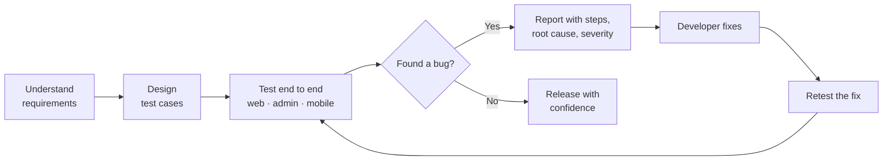

<p align="center">
  
</p>

<p align="center">
  <a href="https://git.io/typing-svg">
    
  </a>
</p>

<p align="center">
  <a href="https://github.com/tuhin-swe?tab=repositories"></a>
  <a href="https://drive.google.com/file/d/1Zcf35-3ySBJi4pk5Y4KJMe45R61vApxd/view?usp=sharing"></a>
  <a href="https://www.linkedin.com/in/arifur-rahman-tuhin-swe/"></a>
  <a href="mailto:arifur.swe@gmail.com"></a>
</p>

<table align="center">
  <tr>
    <td align="center" width="200"><h2>10+</h2><sub>SaaS products tested<br>end to end</sub></td>
    <td align="center" width="200"><h2>5</h2><sub>industries: e-commerce, food delivery,<br>ride sharing, property, retail POS</sub></td>
    <td align="center" width="200"><h2>6</h2><sub>surfaces: website, admin panel,<br>customer, seller, rider and driver apps</sub></td>
  </tr>
</table>

---

## About Me

I'm an **SQA Engineer from Dhaka, Bangladesh** with a B.Sc. in Software Engineering (Daffodil International University, CGPA 3.60/4.00).

At RazinSoft I'm the quality gate for a family of live SaaS products: every website, admin panel and mobile app passes through my hands before it reaches a customer. I test end to end, write bug reports a developer can act on in one read, work with the team on the fix, and retest before release.

I'm now in the **Full Stack SDET: Road to SDET** program, adding automation, performance testing and CI/CD on top of that foundation, and I'll ship a real-world capstone project within the 3-month program.

---

## What I Do

<table>
  <tr>
    <td width="33%" valign="top">
      <h3 align="center">End-to-End Manual Testing</h3>
      <p align="center"><sub>Website, admin panel and every mobile app in a product, tested as one connected system: a customer orders, a seller accepts, a rider delivers, the admin sees it all.</sub></p>
    </td>
    <td width="33%" valign="top">
      <h3 align="center">Bug Reports That Get Fixed</h3>
      <p align="center"><sub>Clear reproduction steps, root-cause analysis, severity and priority. Then I retest every fix across releases so nothing slips back in.</sub></p>
    </td>
    <td width="33%" valign="top">
      <h3 align="center">API and Beyond</h3>
      <p align="center"><sub>REST API testing with Postman for status codes, payloads and business logic such as fees and commissions. On ReadyPOS, I stepped into the codebase and shipped fixes and features myself.</sub></p>
    </td>
  </tr>
</table>

---

## Products I've Tested

Same discipline on every product: test every flow end to end, report what breaks with clear steps and root cause, partner with developers on the fix, then retest before release.

<table>
  <tr>
    <td width="50%" valign="top">
      <h3>🛒 E-commerce</h3>
      <b>ReadyEcommerce</b> · multi-vendor marketplace, the base platform behind several client stores<br>
          
      <br><br>
      <b>ReadyGrocery</b> · grocery ordering platform built on the ReadyEcommerce foundation<br>
          
      <br><br>
      <b>Client stores</b> (e.g. GiftZoneAE) · white-label builds, verified against each client's requirements<br>
          
      <br><br>
      <b>AliCom</b> · single-vendor online store<br>
       
      <br><br>
      <b>PewPew</b> · PC builds, computer accessories and services for Kuwait and Saudi Arabia<br>
        
    </td>
    <td width="50%" valign="top">
      <h3>🍔 Food Delivery</h3>
      <b>Ready Restaurant</b> · restaurant ordering and delivery<br>
          
      <br><br>
      <h3>🚗 Ride Sharing</h3>
      <b>ReadyRide</b> · ride-hailing platform<br>
         
      <br><br>
      <b>Client ride apps</b> · customised ReadyRide deployments, checked A to Z against each client's own requirements<br>
         
      <br><br>
      <h3>🏠 Property</h3>
      <b>RentDo</b> · buy, sell and rent property marketplace<br>
         
      <br><br>
      <h3>🧾 Retail POS</h3>
      <b>ReadyPOS</b> · point-of-sale system for shops, and the product where I went furthest beyond testing<br>
       
    </td>
  </tr>
</table>

### Spotlight: ReadyPOS, where QA met development

ReadyPOS is where I stepped beyond the tester's seat. After testing the system end to end and reporting every issue, I was given codebase access and took ownership of getting it customer-ready:

- **Fixed defects directly** in a dedicated QA branch and verified each fix myself
- **Built new features** by thinking like a shop owner: what a customer needs on day one, where they might get stuck, and what makes daily use effortless
- **Refined the UI** across the product so it works as one cohesive, modern system
- **Used AI-assisted tooling** to implement and verify changes faster

The outcome: a POS product shaped around real business needs, with QA and development working as a single loop.

---

## How I Work



---

## Experience

| Role | Company | Period |
|---|---|---|
| **Junior SQA Engineer** | RazinSoft | Aug 2026 – Present |
| **SQA Intern** | Goinnovior Limited | Nov 2025 – Jan 2026 |
| **Support Team Lead** | Shohoz Software | Sep 2024 – Sep 2025 |

<details>
<summary><b>More about each role</b></summary>
<br>

**RazinSoft**
- End-to-end manual testing of the products above across website, admin panel and mobile apps
- REST API testing with Postman: status codes, JSON payloads, and business logic such as fee and commission calculations
- Bug reports with root-cause analysis plus Critical / Major / Minor / Low severity and priority, so the team can triage releases fast
- Partnering with developers on fixes and retesting every fix before release
- Reviewing admin, seller and rider workflows to catch functional gaps before they reach production

**Goinnovior Limited**
- Manual and functional testing on live projects under senior QA guidance

**Shohoz Software**
- Investigated, reproduced and documented client-reported issues with clear technical findings for developers
- Grew from Software Support Executive to Interim Team Lead to Support Team Lead within a year

</details>

---

## Skills

| Area | What I work with |
|---|---|
| **Testing Types** | Manual, Functional, Regression, Smoke, Sanity, Exploratory, Cross-Browser, Mobile App |
| **QA Process** | STLC, SDLC, Defect Life Cycle, Requirement Analysis, Test Case Design, Retesting |
| **Bug Reporting** | Root-cause analysis, reproduction steps, severity and priority classification |
| **API Testing** | Postman |
| **Database** | MySQL (basic SQL) |
| **Languages and Tools** | JavaScript (basic), Git, GitHub |

<p>
  
  
  
  
  
</p>

---

## Road to SDET: My Learning Journey

> A 20-module Full Stack SDET program, started October 2026, ending with a real-world capstone project to deliver within 3 months.

**Foundations I bring in**
- [x] Manual testing and bug reporting
- [x] API testing with Postman
- [x] Database basics (MySQL)
- [x] JavaScript basics

**Program roadmap** (updated as I go)

| Phase | Modules | Status |
|---|---|---|
| **1. Test and Code Foundations** | Manual Testing (AI-assisted), API Testing with Postman, MySQL, JavaScript, TypeScript, Problem Solving | In progress |
| **2. Full Stack Understanding** | Backend (Node and Express), Frontend (Next.js), Docker, System Design and Architecture | Upcoming |
| **3. Performance and Security** | Performance Testing (K6), Linux, Security Testing (Burp Suite), AWS Basics | Upcoming |
| **4. Automation Engineering** | UI Automation with Playwright, API Automation with Playwright, CI/CD | Upcoming |
| **5. Career Ready** | Interview Preparation, Industry-grade Capstone Project | Upcoming |

```text
Program progress  [██░░░░░░░░░░░░░░░░░░]  just started
```

---

<!--## Featured QA Work  -->

<!-- Replace each link below with the exact repository URL. Delete rows you don't want to show. -->
<!--
| Project | Type | Tools | What's inside |
|---|---|---|---|
| [E-commerce API Testing](https://github.com/tuhin-swe?tab=repositories) | API Testing | Postman | Test cases and test analysis |
| [E-commerce Manual Testing](https://github.com/tuhin-swe?tab=repositories) | Manual Testing | Spreadsheets | Test cases, bug reports, test analysis |
| [Playwright Practice](https://github.com/tuhin-swe?tab=repositories) | UI Automation | Playwright, JavaScript | Automated tests from my SDET course |
| **Capstone: Real-world Project** | End-to-end QA and automation | *Coming soon* | Will be added after the program project |
 -->
<p align="center">
  <a href="https://github.com/tuhin-swe?tab=repositories"></a>
</p>

---

## Training and Community

- Full Stack SDET Program, Road To SDET (ongoing)
- Introduction to Software Testing (completed Apr 2022)
- Volunteer, Bangladesh Aspiring QA Community

---

<h3 align="center">Let's build quality software together</h3>

<p align="center">
  <a href="https://drive.google.com/file/d/1Zcf35-3ySBJi4pk5Y4KJMe45R61vApxd/view?usp=sharing"></a>
  <a href="https://www.linkedin.com/in/arifur-rahman-tuhin-swe/"></a>
  <a href="mailto:arifur.swe@gmail.com"></a>
</p>

<p align="center"><i>Open to SQA Engineer and SDET opportunities.</i></p>

<p align="center">
  
</p>
